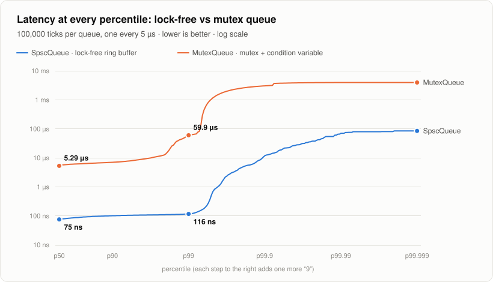
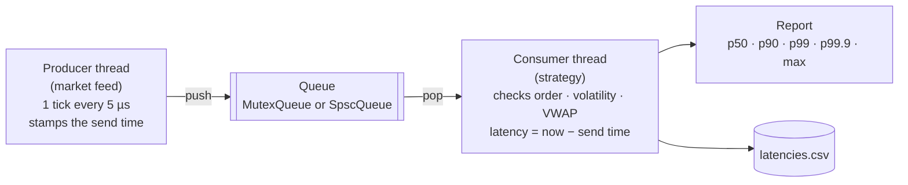
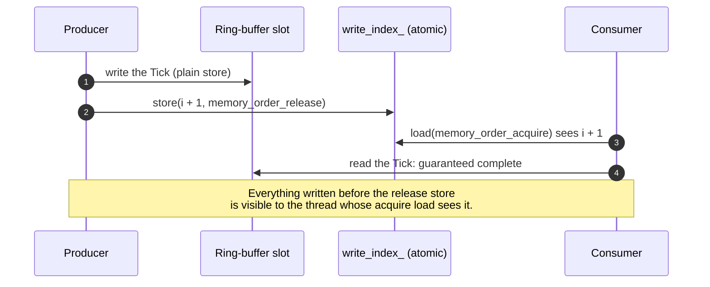

<div align="center">

# C++ Low-Latency Tick Pipeline

**How fast can two threads pass data to each other, and how do you measure it honestly?**

[](https://github.com/AbdelkaderBelhadj-code/cpp-low-latency-pipeline/actions/workflows/ci.yml)


[](LICENSE)

<sub>Part of a 3-project series &nbsp;·&nbsp; <b>C++ Low-Latency Pipeline</b> &nbsp;·&nbsp; <a href="https://github.com/AbdelkaderBelhadj-code/python-probability-stats-lab">Probability &amp; Statistics Lab</a> &nbsp;·&nbsp; <a href="https://github.com/AbdelkaderBelhadj-code/python-performance-concurrency">Python Performance &amp; Concurrency</a></sub>

</div>

<br>

<p align="center">
  <picture>
    <source media="(prefers-color-scheme: dark)" srcset="docs/images/latency-percentiles-dark.svg">
    
  </picture>
</p>

## At a glance

A producer thread sends market-data ticks to a consumer thread. Every tick is timestamped, and the same pipeline runs
twice, first through a classic **mutex queue** and then through a **lock-free ring buffer**. Only the queue changes.

| | Lock-free `SpscQueue` | `MutexQueue` (mutex + condition variable) |
|---|---|---|
| **p50 latency** (typical tick) | **75 ns** | 5.3 µs, 70× slower |
| **p99 latency** (1 tick in 100 is slower) | **116 ns** | 59.9 µs, 500× slower |
| **Max throughput** (burst mode) | **8.5 M ticks/s** | 2.6 M ticks/s |
| **Correctness** | 100,000 / 100,000 ticks, in order | 100,000 / 100,000 ticks, in order |

> [!NOTE]
> Measured on an Intel i5-10300H laptop (4 cores / 8 hyper-threads), Windows 11, GCC 16 `-O2`.
> Absolute numbers change from machine to machine. The ratios are the story.

**Contents:** [Why](#why-this-project) · [How it works](#how-it-works) · [Quick start](#quick-start) ·
[Results](#results) · [Key findings](#key-findings) · [Experiments](#experiments-to-try) ·
[Structure](#project-structure) · [Design Q&A](#design-qa) · [Roadmap](#roadmap)

---

## Why this project

In a trading system, one thread reads the market feed and another decides what to do. **Every tick crosses that
thread boundary**, so the handoff sits on the critical path, and its worst case matters as much as its average.
This project isolates that handoff, measures it tick by tick, and compares the textbook solution with the one
low-latency systems actually use. It then checks that the faster queue delivers exactly the same data.

## How it works



**The lock-free handoff in four steps.** No lock, no system call, no sleeping. The correctness comes from the
C++ memory model:



| Component | Role | Concepts it demonstrates |
|---|---|---|
| [`include/tick.hpp`](include/tick.hpp) | The 32-byte message: sequence number, price, quantity, send timestamp | trivially copyable types, padding, `static_assert`, poison pill |
| [`include/timing.hpp`](include/timing.hpp) | A nanosecond clock: CPU timestamp counter calibrated against `steady_clock` | clock resolution, `rdtsc`, thread-safe static initialization |
| [`include/mutex_queue.hpp`](include/mutex_queue.hpp) | **Baseline**: bounded queue with `std::mutex` + 2 condition variables | locks, spurious wake-ups, backpressure |
| [`include/spsc_queue.hpp`](include/spsc_queue.hpp) | **Optimized**: lock-free single-producer/single-consumer ring buffer | `std::atomic`, acquire/release, power-of-two masking, `alignas(64)`, busy-waiting |
| [`include/online_stats.hpp`](include/online_stats.hpp) | Mean and variance of a stream in O(1) memory | Welford's algorithm, numerical stability, n − 1 |
| [`include/latency_stats.hpp`](include/latency_stats.hpp) | Percentile summary of the latency samples | nearest-rank percentiles, why not averages |
| [`src/main.cpp`](src/main.cpp) | The benchmark: threads, pacing, start barrier, report, CSV export | `std::thread`, lambdas, templates as static polymorphism, pre-allocation |
| [`tests/unit_tests.cpp`](tests/unit_tests.cpp) | Edge cases + a 2-thread stress test (runs under ThreadSanitizer in CI) | testing concurrent code |
| [`bench/queue_throughput.cpp`](bench/queue_throughput.cpp) | The queue alone, with threads pinned to chosen CPUs | micro-benchmarks, thread affinity, cache coherence |

## Quick start

Requirements: a C++17 compiler (GCC, Clang or MSVC) and CMake ≥ 3.16. There are no other dependencies.

```bash
git clone https://github.com/AbdelkaderBelhadj-code/cpp-low-latency-pipeline.git
cd cpp-low-latency-pipeline
cmake -S . -B build -DCMAKE_BUILD_TYPE=Release
cmake --build build --config Release
ctest --test-dir build -C Release --output-on-failure   # unit tests
./build/latency_pipeline                                 # MSVC: .\build\Release\latency_pipeline.exe
```

<details>
<summary><b>No CMake? One-line compiler commands</b></summary>

```bash
# GCC / Clang (Linux, macOS, MinGW). On Linux add -pthread.
g++ -std=c++17 -O2 -Wall -Wextra -Iinclude src/main.cpp -o latency_pipeline
g++ -std=c++17 -O2 -Wall -Wextra -Iinclude tests/unit_tests.cpp -o unit_tests
g++ -std=c++17 -O2 -Wall -Wextra -Iinclude bench/queue_throughput.cpp -o queue_throughput
```
```bat
:: MSVC, from the "x64 Native Tools Command Prompt for VS"
cl /std:c++17 /O2 /EHsc /W4 /wd4324 /Iinclude src\main.cpp /Fe:latency_pipeline.exe
```
</details>

<details>
<summary><b>Command-line options</b></summary>

| Command | What it does |
|---|---|
| `latency_pipeline` | 100,000 ticks per queue, one every 5,000 ns, samples written to `latencies.csv` |
| `latency_pipeline 1000000 0` | **burst mode**: sends as fast as possible, which measures *throughput* (latency then shows queueing delay) |
| `latency_pipeline 200000 2000 out.csv` | `[num_ticks] [gap_ns] [csv_path]` |
| `queue_throughput 2 3` | SPSC queue alone, producer pinned to CPU 2 and consumer to CPU 3 (the same physical core on most Windows machines) |
| `queue_throughput 2 4` | the same, on two different physical cores |

</details>

## Results

```text
C++ low-latency tick pipeline
  ticks : 100000 per run, one every 5000 ns, queue capacity 1024
  clock : CPU time-stamp counter (rdtsc), resolution 5 ns, one call costs ~8 ns
  cores : 8 hardware threads

latency (ns)      mean       p50       p90       p99     p99.9         max
MutexQueue       17452      5289      7000     59924   3024502     3956223
SpscQueue          113        75       101       116     11499      675387

consumer checks (same seed -> both queues must deliver exactly the same data)
  MutexQueue | all ticks received in order | 199835 ticks/s | stdev(log-return) = 0.001001 (expected 0.001000) | VWAP = 127.2199
  SpscQueue  | all ticks received in order | 199897 ticks/s | stdev(log-return) = 0.001001 (expected 0.001000) | VWAP = 127.2199

SpscQueue vs MutexQueue: p50 is 70.5x lower, p99 is 516.6x lower
```

**How to read it:**

1. **p50, the typical tick: 70× faster.** A MutexQueue consumer *sleeps* when the queue is empty, and the OS needs
   microseconds to wake it up. The SPSC consumer never sleeps: it spins, and sees a new tick as soon as the cache line changes.
2. **The tail is the real story: p99 is 500× better.** The rare slow ticks (up to milliseconds) come from the operating
   system: interrupts, and the scheduler pausing or moving a thread. Production systems remove them by pinning threads to
   isolated cores.
3. **The mean misleads.** MutexQueue's mean (17 µs) is 3× its median, because a few slow ticks pull it up. That's why
   latency is reported in percentiles.
4. **Correctness is checked, not assumed.** Both runs deliver every tick in order, with an *identical* VWAP and
   volatility, and the measured volatility (0.001001) matches the producer's parameter (0.001).

**Thread placement, measured with `bench/queue_throughput.cpp`** (the SPSC queue alone, 50 million items):

| Placement | Throughput | Cost per item |
|---|---|---|
| Same physical core, 2 hyper-threads (`queue_throughput 2 3`) | **~177 M items/s** | ~5.6 ns |
| Two different cores (`queue_throughput 2 4`) | **~28 M items/s** (sometimes ~120) | ~35 ns |

## Key findings

> [!IMPORTANT]
> **1. The ruler was the first bottleneck.** `std::chrono::steady_clock` had a **1,000 ns** resolution with this
> GCC build, so a 75 ns handoff measured as "0". The pipeline now reads the CPU **timestamp counter** (`rdtsc`,
> about 5 ns steps), calibrated once against `steady_clock`. Always measure your clock before measuring anything else.

- **Thread placement beats code tweaks: 7×.** Hyper-threads of one core share L1/L2, so data doesn't have to cross the
  chip. Between cores, every cache line travels through the shared L3 (the coherence protocol). Occasional fast
  cross-core runs are *batching*: when the consumer lags slightly, one 64-byte line carries 8 items at once.
- **`alignas(64)` made no measurable difference here, and that's explainable.** Each `push` reads the consumer's index
  and each `pop` reads the producer's index, so those cache lines bounce anyway (*true* sharing). Padding pays off once
  each side keeps a cached copy of the other's index (see the roadmap).
- **The mutex latency is bimodal:** about 27% of ticks at 1–2 µs and 47% at 4–8 µs. The log-scale histograms in the
  [Python analysis repo](https://github.com/AbdelkaderBelhadj-code/python-performance-concurrency) show it, while a
  single average would hide it.
- **Known limitation: coordinated omission.** Latency is measured from the *actual* send time. If the producer itself is
  delayed (for example, blocked on a full queue), that delay isn't counted. Measuring from the *scheduled* send time
  would fix it.

## Experiments to try

| Change | What happens | Why |
|---|---|---|
| Remove the three `alignas(64)` in `spsc_queue.hpp` | No measurable change in this design (tested) | True sharing dominates: every operation reads the other thread's counter |
| Use `memory_order_seq_cst` everywhere | Slightly slower on x86 | A sequentially-consistent store needs a full fence (`xchg`); a release store is a plain `mov` |
| Use `steady_now_ns()` instead of `now_ns()` | SPSC percentiles collapse to 0 or 1,000 ns (on MinGW GCC) | The clock is coarser than the latency itself |
| Run `latency_pipeline 1000000 0` | Huge latencies, highest throughput | A full queue: latency ≈ items waiting ÷ throughput (Little's law) |
| Change `kQueueCapacity` to 16 or 65536 | Burst throughput and latency change | Small: backpressure. Large: more queueing delay and cache misses |

## Project structure

```text
cpp-low-latency-pipeline/
├── include/
│   ├── tick.hpp              the 32-byte message
│   ├── timing.hpp            rdtsc clock, calibrated against steady_clock
│   ├── mutex_queue.hpp       baseline: mutex + condition variables
│   ├── spsc_queue.hpp        lock-free single-producer / single-consumer ring buffer
│   ├── online_stats.hpp      Welford mean / variance in O(1) memory
│   └── latency_stats.hpp     nearest-rank percentiles
├── src/main.cpp              the benchmark: producer, consumer, report, CSV
├── tests/unit_tests.cpp      edge cases + 2-thread stress test (ThreadSanitizer in CI)
├── bench/queue_throughput.cpp  queue-only micro-benchmark with thread pinning
├── docs/DESIGN_QA.md         148 questions and answers about the design
├── .github/workflows/ci.yml  build + test on Linux, Windows, macOS + ThreadSanitizer
└── CMakeLists.txt
```

## Design Q&A

[**docs/DESIGN_QA.md**](docs/DESIGN_QA.md) has 148 questions with short answers, from this project's design choices
down to C++ fundamentals, concurrency and latency engineering. A few examples:

- *Why is the load of your own index `relaxed`, but the other thread's index `acquire`?*
- *Why `assign(n, 0)` for the latency buffer instead of `reserve(n)`?* (page faults in the hot path)
- *What would break if two producers used the SPSC queue?*
- *Is your measurement affected by coordinated omission?*
- *What do acquire and release compile to on x86, and on ARM?*

## Roadmap

- [ ] Pin the producer and consumer threads in the main benchmark (the pinned micro-benchmark already shows a 7× effect)
- [ ] Cache the other thread's index inside `SpscQueue`, then re-measure the effect of `alignas(64)`
- [ ] `pop_batch()` to drain many ticks per call
- [ ] Record into an HDR histogram instead of storing every sample
- [ ] Measure from the scheduled send time to remove coordinated omission
- [ ] `std::jthread` (C++20) so threads are always joined, even on exceptions

## The series

| Project | Question it answers |
|---|---|
| **C++ Low-Latency Pipeline** (this repo) | How fast can two threads exchange data, and how do you measure it honestly? |
| [Probability & Statistics Lab](https://github.com/AbdelkaderBelhadj-code/python-probability-stats-lab) | Do I really understand the math? Every formula is checked against a simulation |
| [Python Performance & Concurrency](https://github.com/AbdelkaderBelhadj-code/python-performance-concurrency) | What changes in Python (the GIL), and what does this repo's latency data say statistically? |

## License

[MIT](LICENSE) © 2026 Belhadj Abdelkader
